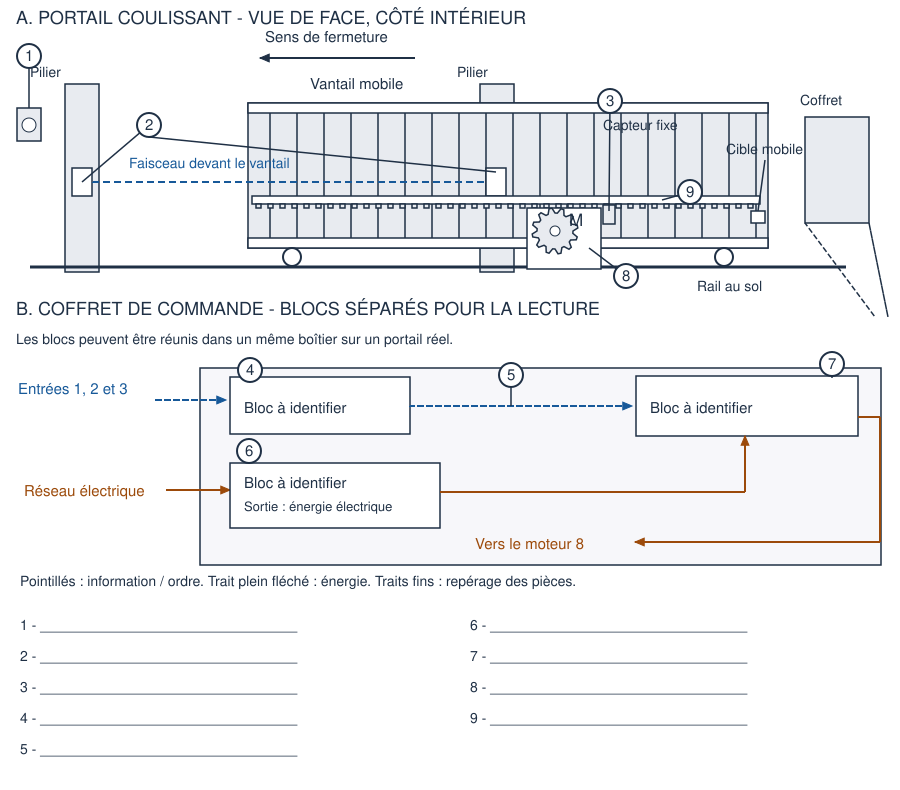
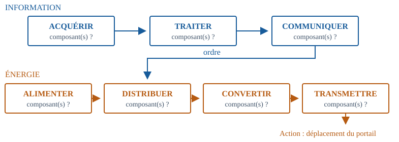

# 3e - Un portail, deux chaînes

Comment les chaînes d'information et d'énergie coopèrent-elles dans un portail automatique ?

**Durée : 55 minutes.** PC avec navigateur ; aucun compte ni accès Internet nécessaire après distribution du fichier.

## Observer et légender le portail

Associer les repères 1 à 9 aux composants du tableau.

## Partie 1

Nous étudions un modèle simplifié de portail coulissant, uniquement pendant sa fermeture. Le bouton de fermeture doit rester appuyé. La carte autorise le mouvement si le passage est libre et si le portail n'est pas déjà fermé. Dès qu'une de ces conditions n'est plus respectée, elle demande l'arrêt. Tous les composants sont supposés alimentés et en bon état, sauf dans la question de panne.

| Composant du modèle | Ce qu'il fait |
| --- | --- |
| 1 - Bouton de fermeture | Indique la demande de l'utilisateur. |
| 2 - Paire de cellules de détection | Indique si le passage est occupé. |
| 3 - Capteur de fin de course | Indique si le portail est complètement fermé. |
| 4 - Carte programmable | Examine ces informations et décide de l'ordre. |
| 5 - Liaison de commande | Transmet l'ordre de la carte au module de puissance. |
| 6 - Bloc d’alimentation 24 V | Fournit l'énergie électrique adaptée à partir du réseau. |
| 7 - Module de puissance | Autorise ou coupe l'alimentation électrique du moteur selon l'ordre reçu. |
| 8 - Moteur électrique | Transforme l'énergie électrique en énergie mécanique de rotation. |
| 9 - Pignon et crémaillère | Transmettent le mouvement au portail et transforment une rotation en translation. |

**1. Quelle action attend-on du système ? Cite deux informations, autres que la demande de l'utilisateur, nécessaires pour l'autoriser.**

Réponse :

**2. Le capteur de fin de course et le moteur ont-ils le même rôle ? Explique ce que chacun fournit.**

Réponse :

Vocabulaire : un capteur fournit une information ; un actionneur réalise une action grâce à l'énergie reçue. Une translation est un déplacement en ligne droite.

## Partie 2

### Construire les deux chaînes

3. Utilise les composants du document. La chaîne d'information acquiert, traite et communique des informations. La chaîne d'énergie alimente, distribue, convertit et transmet l'énergie nécessaire à l'action.

**Associe un ou plusieurs composants à chaque fonction.**

| Chaîne / fonction | Composant(s) |
| --- | --- |
| Information / acquérir |  |
| Information / traiter |  |
| Information / communiquer |  |
| Énergie / alimenter |  |
| Énergie / distribuer |  |
| Énergie / convertir |  |
| Énergie / transmettre |  |

**4. Quel bloc de la chaîne d'énergie reçoit l'ordre ? Quelle conversion d'énergie a lieu dans le moteur ?**

Réponse :

## Partie 3

### Relier l'ordre à l'action

Ouvrir [l’activité numérique](activite-eleve.html) pour utiliser le laboratoire ; sur papier, appliquer la règle décrite pour prévoir le résultat.

**5. Teste les situations. Indique « fermer » ou « arrêt » et explique un arrêt.**

| Bouton / obstacle / déjà fermé | Ordre |
| --- | --- |
| Appuyé / non / non |  |
| Appuyé / oui / non |  |
| Appuyé / non / oui |  |
| Relâché / non / non |  |

**6. Le moteur tourne mais le portail reste immobile. Dans le modèle, le pignon n'engrène plus avec la crémaillère. Quelle fonction est défaillante ? Justifie à partir de l'observation.**

Réponse :

**7. Un élève dit : « Tout ce qui utilise de l'électricité appartient à la chaîne d'énergie. » Explique pourquoi ce raisonnement est faux avec l'exemple de la carte programmable.**

Réponse :

**Synthèse : la chaîne d'information __________, __________ et __________ les informations. Elle envoie un __________ à la chaîne d'énergie. Celle-ci __________, __________, __________ et __________ l'énergie pour réaliser une __________.**

Réponse :

À comprendre : les capteurs et la carte ont eux aussi besoin d'énergie pour fonctionner. On les classe ici selon leur rôle dans le système. Une flèche d'information représente un message ou un ordre ; une flèche d'énergie représente un transfert d'énergie. Les pertes d'énergie ne sont pas détaillées dans ce schéma fonctionnel.

Défi facultatif : un obstacle apparaît pendant la fermeture. Décris le chemin allant de sa détection à l'arrêt du mouvement en citant les composants concernés.

**Billet de sortie individuel : a) classe le capteur et le moteur dans leur chaîne ; b) donne l'énergie reçue et l'énergie utile fournie par le moteur ; c) explique le rôle de l'ordre envoyé par la carte.**

Réponse :

