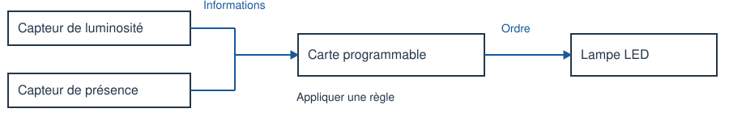

# 4e - Allumer seulement quand c'est utile

Comment commander un éclairage avec deux informations ?

**Durée : 55 minutes.** PC avec navigateur ; aucun compte ni accès Internet nécessaire après distribution du fichier.

## Partie 1

Dans un couloir, la lampe doit s'allumer seulement si une présence est détectée ET si le niveau de luminosité est strictement inférieur à 30. Sinon elle doit être éteinte. Le simulateur utilise un indice de luminosité de 0 à 100 : 0 signifie très sombre et 100 très lumineux. Cet indice est une donnée pédagogique, pas une mesure en lux.

Un capteur fournit une information ; la carte la traite ; un actionneur réalise une action. Une condition est une affirmation vraie ou fausse. Ce schéma représente la commande ; l’alimentation électrique n’est pas dessinée.

| Élément | Rôle |
| --- | --- |
| Capteur de luminosité | Fournir une valeur numérique de 0 à 100. |
| Capteur de présence | Fournir une information : présence ou absence. |
| Carte programmable | Appliquer la règle de commande. |
| Lampe LED | Émettre de la lumière lorsqu'elle est alimentée. |

**1. Quelles sont les deux informations nécessaires pour décider d'allumer ? Quel élément réalise l'action ?**

Réponse :

Sur papier, déroule mentalement les conditions. Sur PC, règle chaque situation et relève l'état de la lampe. Une seule situation ne suffit pas à valider un programme.

## Partie 2

### Tester, corriger et expliquer

Ouvrir [l’activité numérique](activite-eleve.html) pour utiliser le laboratoire ; sur papier, appliquer la règle décrite pour prévoir le résultat.

**2. Avec la règle initiale OU, prévois puis observe le résultat. Après correction, complète la dernière colonne.**

| Luminosité / présence | Prévision avec OU | Observation avec OU | Après correction |
| --- | --- | --- | --- |
| 10 / oui |  |  |  |
| 10 / non |  |  |  |
| 80 / oui |  |  |  |
| 80 / non |  |  |  |
| 30 / oui |  |  |  |

**3. Cite un essai où la règle initiale ne respecte pas le besoin. Explique pourquoi.**

Réponse :

**4. Corrige la règle, puis écris l'algorithme complet : SI ... ALORS ... SINON ... .**

Réponse :

**5. Avec la règle corrigée, que se passe-t-il exactement à 30 si une personne est présente ? Justifie avec le signe de comparaison.**

Réponse :

**6. Garde ET et le signe <. Change uniquement le seuil de 30 à 50. À une luminosité de 40 avec présence, que devient la lampe ? Après l’essai, remets le seuil à 30 et clique sur Appliquer.**

Réponse :

**Synthèse : les capteurs fournissent des __________. Le programme les __________. La lampe est un __________. Avec ET, les deux conditions doivent être __________.**

Réponse :

Défi facultatif : propose deux essais supplémentaires, juste en dessous et juste au-dessus du seuil. Explique leur intérêt.

**Billet de sortie individuel, règle corrigée et seuil 30 : donne l'état de la lampe pour (20 ; absence) puis (29 ; présence). Explique pourquoi remplacer ET par OU serait une erreur.**

Réponse :

