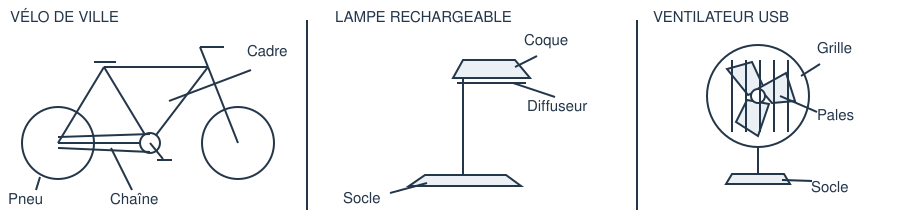

# 5e - Un objet, un besoin, des solutions

Comment expliquer les choix de conception d'un objet du quotidien ?

**Durée : 55 minutes.** Toutes les réponses se font sur la fiche papier. Le PC sert à consulter les documents et à faire les essais demandés.

## Partie 1

Choisis un objet parmi les trois fiches ci-dessous. Ce sont des modèles d'étude simplifiés : les matériaux indiqués ne décrivent pas tous les modèles vendus dans le commerce. Toutes les informations nécessaires sont fournies.

### Les trois objets au choix

| Objet | Composants et matériaux du modèle | Fonctionnement et attente |
| --- | --- | --- |
| Vélo de ville | Cadre : aluminium. Chaîne : acier. Pneus : caoutchouc. À volume égal, l'aluminium est moins massif que l'acier. | L'utilisateur pédale ; la chaîne transmet le mouvement vers la roue arrière. Le cadre soutient l'ensemble ; les pneus assurent le contact avec le sol. L'utilisateur souhaite un vélo facile à transporter. |
| Lampe de bureau rechargeable | Socle : acier. Coque : plastique ABS. Diffuseur : polycarbonate, un plastique translucide. | La batterie fournit de l'énergie électrique à une LED qui émet de la lumière. Le socle stabilise la lampe ; la coque protège les éléments ; le diffuseur répartit la lumière. L'utilisateur souhaite éclairer son bureau sans être ébloui. |
| Ventilateur USB | Pales : plastique ABS. Grille : acier. Socle : acier. | Le port USB fournit l'énergie électrique au moteur qui fait tourner les pales. Les pales mettent l'air en mouvement ; la grille empêche le contact direct avec elles ; le socle stabilise l'appareil. L'utilisateur souhaite un appareil stable et protecteur. |

**Mon objet d'étude :** Vélo de ville, Lampe de bureau rechargeable, Ventilateur USB.

Le besoin est ce qui est nécessaire ou souhaité. La fonction d’usage dit à quoi sert l’objet. Un composant est une pièce ; un matériau est sa matière. Une contrainte est une exigence à respecter : masse limitée, stabilité ou protection, par exemple.

## Partie 2

### Expliquer et améliorer

**1. À quel besoin répond cet objet ? Qui l'utilise ?**

Réponse :

**2. Écris sa fonction d'usage avec un verbe à l'infinitif : « Cet objet permet de... »**

Réponse :

**3. Analyse trois composants de l'objet choisi.**

| Composant | Rôle dans l'objet | Matériau |
| --- | --- | --- |
|  |  |  |
|  |  |  |
|  |  |  |

**4. Repère une contrainte dans la fiche. Explique comment une pièce ou un matériau permet d'y répondre.**

Réponse :

**5. Propose une amélioration pour un utilisateur précis. Justifie son intérêt et cite un inconvénient possible.**

Réponse :

**Synthèse à compléter lors de la mise en commun : la fonction d'usage indique à quoi sert l'________. Il est constitué de __________ fabriqués dans des __________. Les choix de conception doivent respecter des __________.**

Réponse :

Défi facultatif : indique un test concret pour vérifier si ton amélioration répond réellement à l'attente de l'utilisateur.

**Billet de sortie individuel : un casque protège la tête. Donne sa fonction d'usage, puis cite un composant et un matériau possible pour ce composant.**

Réponse :

