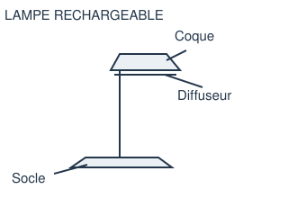

# 5e - Une lampe pour éclairer

À quoi sert une lampe de bureau ?

**Durée : 55 minutes.** Toutes les réponses se font sur la fiche papier. Le PC sert à consulter les documents et à faire les essais demandés.

## Partie 1

La lampe éclaire le bureau. Le socle, en acier, maintient la lampe debout. La coque, en plastique, protège les éléments. Le diffuseur, en plastique translucide, répartit la lumière.

**1. La lampe permet de :** éclairer le bureau, déplacer une personne, mettre l’air en mouvement.

**2. Quelle pièce maintient la lampe debout ? :** le diffuseur, le socle, la coque.

**3. Le socle est fabriqué en :** acier, papier, caoutchouc.

**4. La lampe tombe facilement. Quelle amélioration choisir ? :** un socle plus large, une couleur différente.

À retenir : un composant est une pièce, par exemple le socle. Un matériau est la matière de cette pièce, par exemple l’acier.

**5. Complète : la lampe permet d’__________. Le socle est une __________. L’acier est un __________.**

Réponse :

